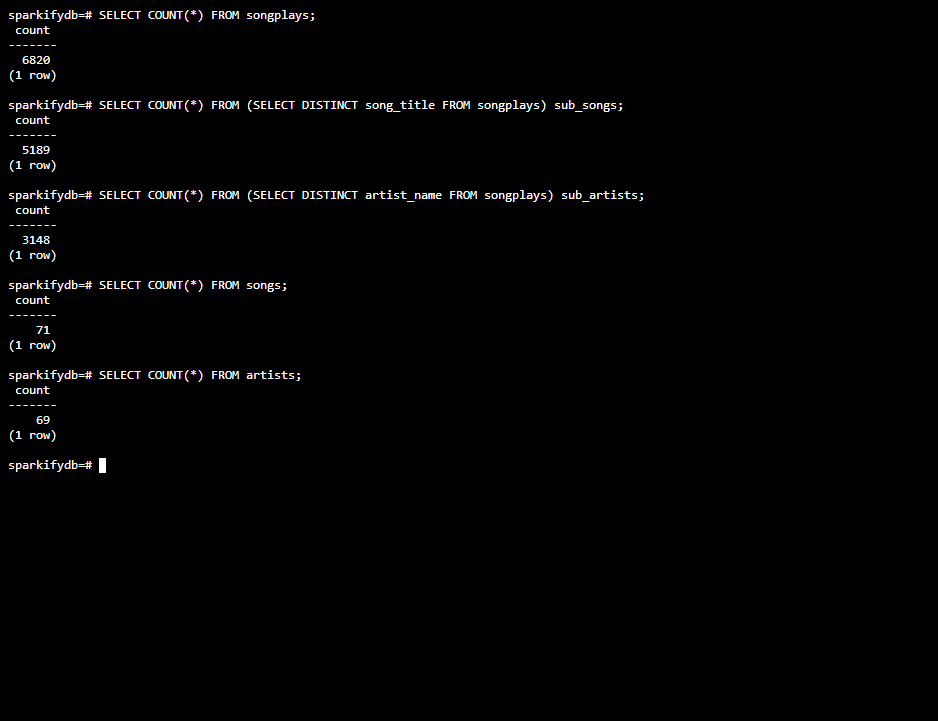
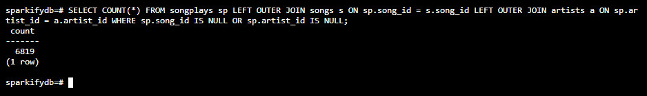
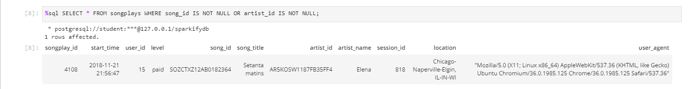
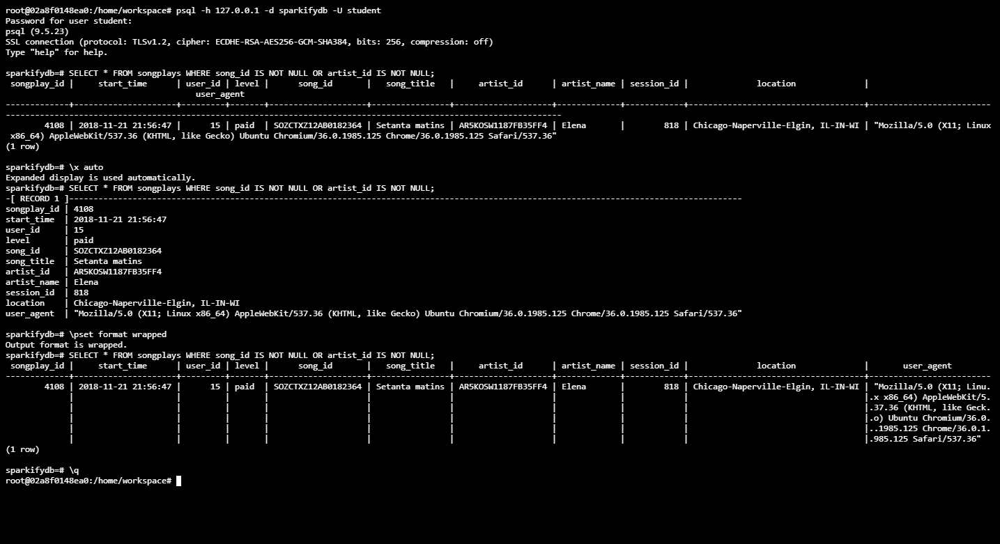
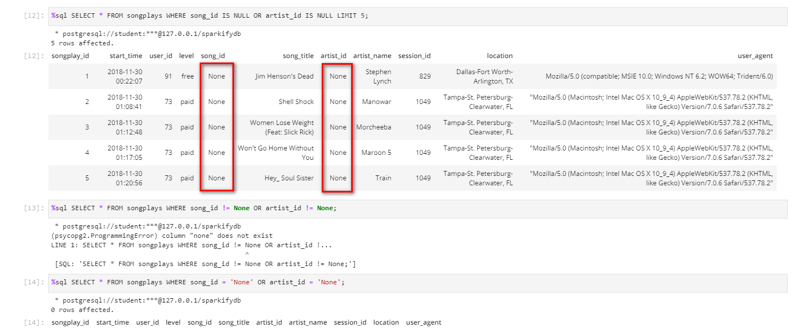
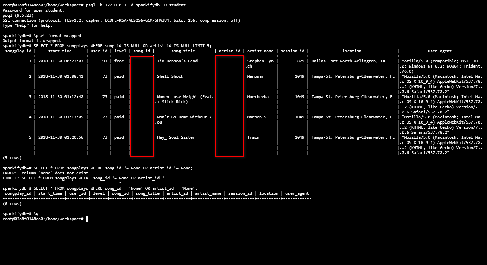

## Introduction


This project is created to fulfill the requests of Sparkify's data analytics team. Based on the feedbacks coming from the team, we know that

- Sparkify had collected data on songs and user activity generated by their music streaming app.
- All the collected data are stored as individual files in JSON format.
- The analytics team is particularly interested in understanding what songs users are listening to.
- They want to get these data into a PostgreSQL database to proceed with further data analysis tasks.

In order to facilitate data analyzation, we can see there is a prerequisite to move data from one location (JSON files stored in the filesystem) to another (tables in PostgreSQL database system). And that would be fulfilled by creating necessary ETL pipelines and database schemas using files provided in this project.

Initially there are 6 files in this project:

1. create_tables.py drops and creates your database (and tables within). You run this file to reset your tables before each time you run your ETL scripts.
2. etl.ipynb reads and processes a single file from song_data and log_data and loads the data into your tables. This notebook contains detailed instructions on the ETL process for each of the tables.
3. etl.py reads and processes files from song_data and log_data and loads them into your tables. You can fill this out based on your work in the ETL notebook.
4. sql_queries.py contains all your sql queries, and is imported into the last three files above.
5. test.ipynb displays the first few rows of each table to let you check your database.
6. README.md provides discussion on your project.

There is also a directory called 'data', which holds two datasets in JSON format, song data and log data, that will be treated as raw data input of this project. We will take a look at the raw data entries of JSON files, too.

Below is an example data entry of a song file:
```json
{"num_songs": 1, "artist_id": "AR5KOSW1187FB35FF4", "artist_latitude": 49.80388, "artist_longitude": 15.47491, "artist_location": "Dubai UAE", "artist_name": "Elena", "song_id": "SOZCTXZ12AB0182364", "title": "Setanta matins", "duration": 269.58322, "year": 0}
```
And an example data entry of a log file:
```json
{"artist":"Elena","auth":"Logged In","firstName":"Lily","gender":"F","itemInSession":5,"lastName":"Koch","length":269.58322,"level":"paid","location":"Chicago-Naperville-Elgin, IL-IN-WI","method":"PUT","page":"NextSong","registration":1541048010796.0,"sessionId":818,"song":"Setanta matins","status":200,"ts":1542837407796,"userAgent":"\"Mozilla\/5.0 (X11; Linux x86_64) AppleWebKit\/537.36 (KHTML, like Gecko) Ubuntu Chromium\/36.0.1985.125 Chrome\/36.0.1985.125 Safari\/537.36\"","userId":"15"}
```
Data files of song data and log data are stored in data/song_data and data/log_data subdirectories, respectively.


## Creating ETL pipelines


It may be tempting to make use of PostgreSQL native tools to carry out the ETL processes, since PostgreSQL has support in JSON files, which means it can manipulate JSON data as a native data type, and provides integrated database functions and operators to assist in the entire ETL process. The problem is, these tools will only work as long as we are using PostgreSQL databases as our only kind of ETL destination, and there is always a chance for a company to implement other kinds of databases. Therefore a non-database dependent solution would be easier to maintain in the long run, and that is the reason to justify the choice of using Python to create ETL pipelines instead.

However, when dealing with enormous amounts of raw data files, we may need to use native database tools to load data in an efficient manner. Some examples of native database tools are Data Pump/SQL\*Loader/External Tables in Oracle, bcp and BULK INSERT command in SQL Server. For PostgreSQL, this would be COPY command.

https://www.postgresql.org/docs/current/sql-copy.html

And here is a nice post showing the performance benefits of deploying COPY command to load data (as well as some sample codes in Python):

https://hakibenita.com/fast-load-data-python-postgresql

If you happen to run into some cases that even COPY command could not meet you expectations, there is a 3rd-party utility you can employ as a last resort : pg_bulkload.

https://github.com/ossc-db/pg_bulkload
https://www.highgo.ca/2020/12/08/bulk-loading-into-postgresql-options-and-comparison/


## Designing database schema


This depends on the database workload type we would be dealing with. From the scope of data to be imported (JSON files generated by a music streaming app), database users (the analytic team), and its proposed usage (understanding what songs users are listening to), we can expect the newly created PostgreSQL database would mainly serves OLAP workloads.

Based on the observation of JSON data entries, at first we can arrange these name-value items into 6 separate groups (values omitted), and it's just a small number of groups. This, along with the scope discussed before, suggest that the star schema may be an acceptable option for the project we are working on.

> __songs__ : _song_id_, _title_, _duration_, _year_<br>
__artists__ : _artist_id_, _artist_latitude_, _artist_longitude_, _artist_location_, _artist_name_<br>
__users__ : _firstName_, _gender_, _lastName_, _level_, _userId_<br>
__sessions__ : _auth_, _itemInSession_, _location_, _method_, _page_, _registration_, _sessionId_, _status_, _ts_, _userAgent_<br>
__others__ : _num_songs_<br>
__duplicates__ : _artist_, _length_, _song_<br>

In ordinary ETL processes, it is usually safe to ingest raw flat files in their entirety into database staging tables, then perform necessary actions (data cleansing, data typecasting, additional calculation, and so on) before moving data to their final destinations. Because we are only interested in understanding what songs users are listening to, we can discard some of the name entries to reduce total amount of data.

>__songs__ : _song_id_, _title_, _duration_, _year_<br>
__artists__ : _artist_id_, _artist_latitude_, _artist_longitude_, _artist_location_, _artist_name_<br>
__users__ : _firstName_, _gender_, _lastName_, _level_, _userId_<br>
__sessions__ : _auth_, _location_, _method_, _page_, _sessionId_, _status_, _ts_, _userAgent_<br>

We will then turn the group "sessions" into a transaction fact table, rename it to "songplays", and add a column named "songplay_id" to act as a surrogate key. The rest groups will become dimension tables. Our final tables will look like this:

### Fact Table

1. __songplays__ : _songplay_id_, _song_id_, _artist_id_, _userId_, _auth_, _location_, _method_, _page_, _sessionId_, _status_, _ts_, _userAgent_

### Dimension Tables

2. __songs__ : _song_id_, _title_, _duration_, _year_
3. __artists__ : _artist_id_, _artist_latitude_, _artist_longitude_, _artist_location_, _artist_name_
4. __users__ : _firstName_, _gender_, _lastName_, _level_, _userId_


## Difference between provided table schema


There are quite a few differences between our derived tables and tables suggested by the project, and we shall take a look at these differences before proceeding with creating tables using default schema provided by the project.

### Dimension Tables

1. __songs__

The table provided by the project adds the column _artist_id_. This increases data redundancy, but it might be handy if there are some SQL queries which only need to find artist information from song data.

2. __time__

The project chooses to create a separate table to host information of timestamp itself, as well as several date/time fields of timestamp. Without knowing proposed __time__ table in advance, there is no clue about actual date/time field requirements of the analytics team in entire content of the project. Besides, it is always possible to extract date/time fields in PostgreSQL databases:

https://www.postgresql.org/docs/13/functions-datetime.html#FUNCTIONS-DATETIME-EXTRACT

One good reason to extract date/time fields in Python codes is to centralize all the ETL operations in Python codes, and leave PostgreSQL database as a relatively clean final destination. This should come up with a cleaner design, hopefully.

### Fact Table

3. __songplays__

The table provided by the project adds a redundant column _level_, renames the column _ts_ to _start_time_ (same as the proposed __time__ table), and discards the column _auth_, _method_, _page_, _status_.

A data engineer may debate whether the column _level_ is needed or not, since this column is readily available in __users__ table, unless we want to do this for reason similar to adding _artist_id_ column to __songs__ table. Renaming the column _ts_ to _start_time_ aligns both __songplays__ and __time__ tables in the same naming style. The discarded columns _auth_, _method_, _page_, _status_ could be useful when troubleshooting app itself, but would serve little purpose when focusing on understanding what songs users are listening to.


## Usage


Under the directory path /home/workspace , first you will need to run create_tables.py script (which will import sql_queries.py behind the scenes) to create a new database and new tables. This command can also reset database (including tables) if you have to do it.

    $ python3 create_tables.py

Then you can proceed with importing data into database tables by running etl.py script.

    $ python3 etl.py

There are also two Jupyter notebook files, test.ipynb and etl.ipynb, which can be used as testing platforms before and/or after running etl.py script. While test.ipynb can serve as a substitute interface to execute SQL queries, etl.ipynb documents the entire ETL process and tests the functionality of ETL pipelines with a minimal set of JSON data files.

Finally, if you are more comfortable to interact with relational databases directly, it is recommended to connect to local database by using native database clients instead. The credentials can be found in all files except this README and sql_queries.py script. Following is a ready-to-run example command if you are using PostgreSQL CLI client.

    $ psql -h 127.0.0.1 -d sparkifydb -U student

Remember you will have to manually enter password when executing this command.


## Verification of ETL process


>Notice : in the following query results we preserved both _song_title_ and _artist_name_ JSON items in log_data files and inserted them into __songplays__ table to make verification task easier to understand, but we will drop these 2 columns in final submitted project files to maintain consistency with initial version of project file contents.

It seems the JSON data files we received is just a small and incomplete batch. By running the following SQL queries, we know there are 6820 data entries loaded from log_data JSON files into __songplays__ table, and there are 5189 unique song titles and 3148 unique artist names in __songplays__ table. But, at the same time, there are only 71 song titles and 69 artist names in __songs__ and __artists__ tables, respectively.

    SELECT COUNT(*) FROM songplays;
    SELECT COUNT(*) FROM (SELECT DISTINCT song_title FROM songplays) sub_songs;
    SELECT COUNT(*) FROM (SELECT DISTINCT artist_name FROM songplays) sub_artists;
    SELECT COUNT(*) FROM songs;
    SELECT COUNT(*) FROM artists;

[](01.png)

With only a scarce number of songs and artists in song_data JSON files, it will render columns _song_id_ and _artist_id_ in __songplays__ table almost useless, because most of the data entries in log_data JSON files have song titles and artist names that are not available in song_data JSON files.

    SELECT COUNT(*) FROM songplays sp LEFT OUTER JOIN songs s ON sp.song_id = s.song_id LEFT OUTER JOIN artists a ON sp.artist_id = a.artist_id WHERE sp.song_id IS NULL OR sp.artist_id IS NULL;

[](02.png)

Luckily there is one (and only one) row entry that can prove our ETL pipelines work as expected. If you can find a table row in your final result set which contains the same _song_id_ and _artist_id_ as displayed below, then you are good to go.

If you are using test.ipynb, run the following command.

    %sql SELECT * FROM songplays WHERE song_id IS NOT NULL OR artist_id IS NOT NULL;

[//]: # (https://stackoverflow.com/questions/4823468/comments-in-markdown)
[//]: # (https://stackoverflow.com/questions/31558605/zoomable-image-in-markdown)

[](03_query_ipython.png)

Or, if you are querying PostgreSQL database directly, you should execute the following SQL query instead.

    SELECT * FROM songplays WHERE song_id IS NOT NULL OR artist_id IS NOT NULL;

[//]: # (https://dba.stackexchange.com/questions/1728/how-to-wrap-long-lines-when-selecting-sql-text-columns)
[//]: # (https://stackoverflow.com/questions/9604723/alternate-output-format-for-psql)

[](04_query_psql.png)

Finally, this is just a friendly reminder that you should be careful when dealing with NULL values, since ipython-sql and database native clients represent NULL values differently. You may run into some errors if you do not follow SQL rules for NULL values.

[](05_error_ipython.png)
[](06_error_psql.png)
